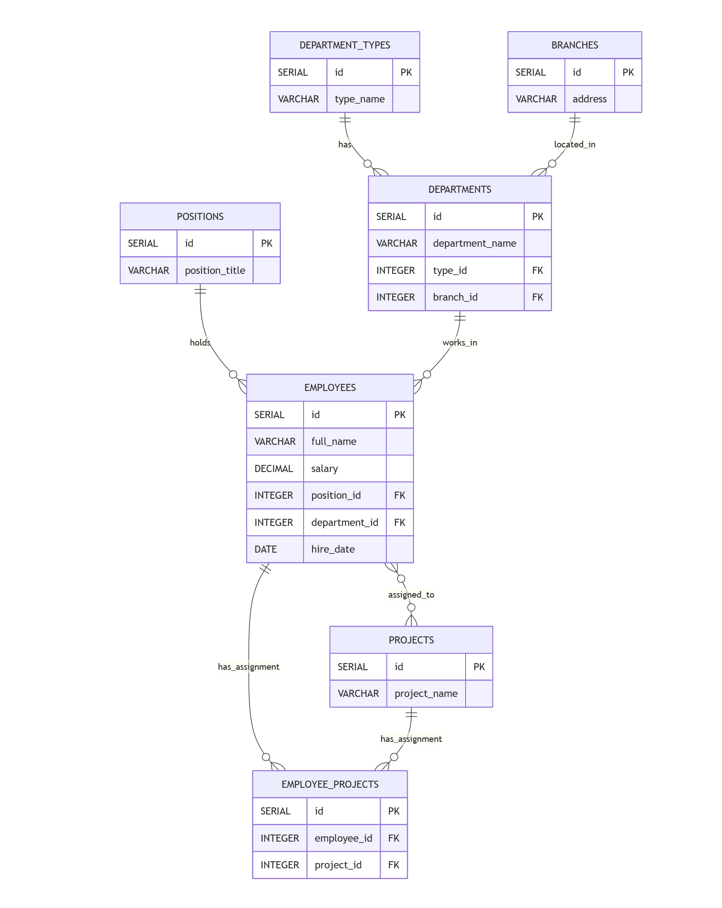

# BD
## Задание 1. 

Опишите не менее семи таблиц, из которых состоит база данных. Определите:

1.	Сотрудники (employees) — основная информация о сотрудниках.
2.	Должности (positions) — справочник должностей.
3.	Структурные подразделения (departments) — справочник подразделений (отделы, группы, департаменты).
4.	Типы подразделений (department_types) — справочник типов (Отдел, Группа, Департамент).
5.	Филиалы (branches) — справочник адресов филиалов.
6.	Проекты (projects) — справочник проектов.
7.	Назначения на проекты (employee_projects) — таблица-связка между сотрудниками и проектами (связь "многие-ко-многим", так как один сотрудник может быть назначен на несколько проектов, а на одном проекте может быть несколько сотрудников).

# Описание таблиц базы данных

## Схема базы данных сотрудников

### Таблица: `department_types` (Типы подразделений)

| Столбец | Тип данных | Ограничения | Описание |
|---------|------------|-------------|----------|
| `id` | `SERIAL` | `PRIMARY KEY` | Уникальный идентификатор типа |
| `type_name` | `VARCHAR(50)` | `NOT NULL, UNIQUE` | Название типа (Отдел, Группа, Департамент) |

### Таблица: `branches` (Филиалы)

| Столбец | Тип данных | Ограничения | Описание |
|---------|------------|-------------|----------|
| `id` | `SERIAL` | `PRIMARY KEY` | Уникальный идентификатор филиала |
| `address` | `VARCHAR(500)` | `NOT NULL, UNIQUE` | Полный адрес филиала |

### Таблица: `positions` (Должности)

| Столбец | Тип данных | Ограничения | Описание |
|---------|------------|-------------|----------|
| `id` | `SERIAL` | `PRIMARY KEY` | Уникальный идентификатор должности |
| `position_title` | `VARCHAR(100)` | `NOT NULL, UNIQUE` | Название должности |

### Таблица: `projects` (Проекты)

| Столбец | Тип данных | Ограничения | Описание |
|---------|------------|-------------|----------|
| `id` | `SERIAL` | `PRIMARY KEY` | Уникальный идентификатор проекта |
| `project_name` | `VARCHAR(255)` | `NOT NULL, UNIQUE` | Название проекта |

### Таблица: `departments` (Структурные подразделения)

| Столбец | Тип данных | Ограничения | Описание |
|---------|------------|-------------|----------|
| `id` | `SERIAL` | `PRIMARY KEY` | Уникальный идентификатор подразделения |
| `department_name` | `VARCHAR(255)` | `NOT NULL` | Название подразделения |
| `type_id` | `INTEGER` | `NOT NULL, FOREIGN KEY` | Ссылка на тип подразделения |
| `branch_id` | `INTEGER` | `NOT NULL, FOREIGN KEY` | Ссылка на филиал |

### Таблица: `employees` (Сотрудники)

| Столбец | Тип данных | Ограничения | Описание |
|---------|------------|-------------|----------|
| `id` | `SERIAL` | `PRIMARY KEY` | Уникальный идентификатор сотрудника |
| `full_name` | `VARCHAR(255)` | `NOT NULL` | Полное имя сотрудника |
| `salary` | `DECIMAL(10,2)` | `NOT NULL, CHECK (salary > 0)` | Оклад сотрудника |
| `position_id` | `INTEGER` | `NOT NULL, FOREIGN KEY` | Ссылка на должность |
| `department_id` | `INTEGER` | `NOT NULL, FOREIGN KEY` | Ссылка на подразделение |
| `hire_date` | `DATE` | `NOT NULL` | Дата найма |

### Таблица: `employee_projects` (Назначения на проекты)

| Столбец | Тип данных | Ограничения | Описание |
|---------|------------|-------------|----------|
| `id` | `SERIAL` | `PRIMARY KEY` | Уникальный идентификатор назначения |
| `employee_id` | `INTEGER` | `NOT NULL, FOREIGN KEY` | Ссылка на сотрудника |
| `project_id` | `INTEGER` | `NOT NULL, FOREIGN KEY` | Ссылка на проект |

## Условные обозначения:
•	PK - Primary Key (Первичный ключ)
•	FK - Foreign Key (Внешний ключ)
•	||--o{ - связь "один ко многим"
•	}o--o{ - связь "многие ко многим"
